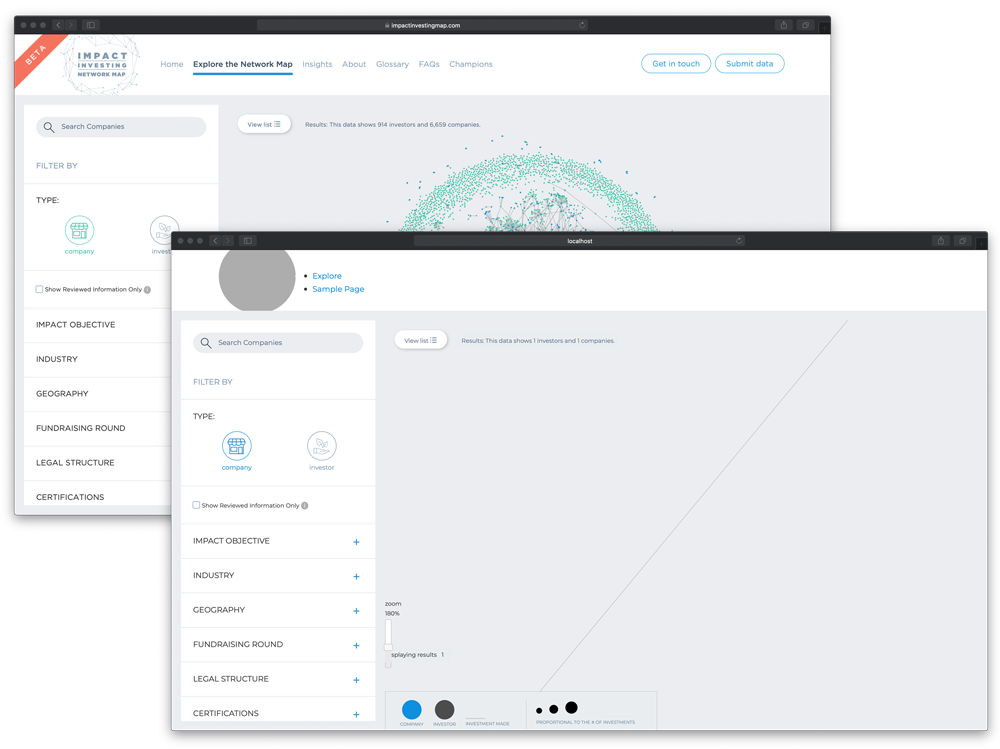

# Impact Investment Relationship Matrix (IIRMa)

## About

We are excited to announce the release of the Impact Investment
Relationship Matrix (IIRMa), an open source project designed to allow
all to build data visualization products to bring to life the
connections between investors, companies and funds. Originally created
to map the direct investments made into companies by investors in the
Impact Investing field, the release of the product and code enables all
to present financial data from a wide variety of fields to show the
breadth, depth and the interconnections at the heart of multiple
financial transactions in a graphically engaging format. As with all
open source projects, it can be adjusted and modified widely, but the
Mapper is ideally designed to bring greater accessibility and
transparency to financial data where relationships are not easily seen
and where that visualization can highlight or reveal relationships.

The code powering IIRMa, including filtering options and insights
section will be open and free to use on the Case Foundation's GitHub
account, and we look forward to seeing how this visualization product
will be used by others to present data in a more dynamic and accessible
way.

While the basis of the Impact Investing Network Map was to display
historical direct investments made into companies by investors using
publicly available data, with the open sourcing of this product, you can
use the code to bring your own Impact Investing data to life, expand the
options and features available or, potentially, apply it to data outside
the Impact Investing sector.

To learn more about how you can use this open source project to visualize your data, please [visit the wiki](https://github.com/casefoundation/IIRMa/wiki).

# The Origins of IIRMa

In 2017, The Case Foundation launched the Impact Investing Network Map,
with data partners Impact Space and CrunchBase, to present the best
publicly available data on impact investments to better inform the
sector of the size, breadth and depth of the impact investing ecosystem.
We believed that incorporating engaging data visualizations to display
connections between investors and companies would not only bring greater
accessibility and transparency to Impact Investing data but would
demonstrate growth and inspire action in this catalytic movement.

## Contributing

See [Contributing](Contributing.md) for additional information.

## License

See [License](License.txt) for additional information.
